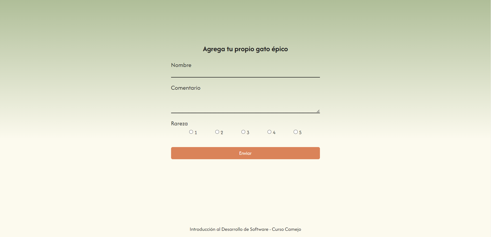

# Clase de HTML + CSS
Buenas! Acá está el ejemplo de la página que trabajamos en clase. 
Si te animás, forkeá este repo e intentá replicar el form de la imagen de referencia.

PD: [acá vas a encontrar](https://www.dreamhost.com/blog/es/rem-vs-em-unidad-css/) la definición de `rem`, la unidad que usamos en varias partes.

